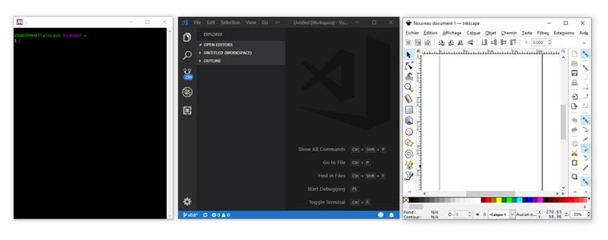

**Tutorial 01**: Version 0.1 (written by Uriel Deveaud - 01/2019) 

[**Return to Main Menu**](../README.md)


# Setup your development environment under Win10

So, let´s start from the beginning, you computer is up to become your building machine, but you need to prepare your setup to be able to build applications. First of all, you will need to download a couple of Free softwares to perform each tasks, as always, i recommend to get some free or open source applications, but other professional softwares will be fine. Just mind the corresponding download, regarding your operating system, and don´t forget that VCV Rack is only working on 64bits OS !

- **Coding**,  [**Visual Studio Code**](https://code.visualstudio.com/), one of the best, free and great ui
- **Drawing**, [**Inskape**](https://inkscape.org/), but it can be done with Adobe illustrator, Gravit, etc... or any on-line SVG Editor
- **Building**, [**MSYS64 and its installer**](https://www.msys2.org/), the only one that actually works for me...

Once you have installed those softwares, you need to understand what kind of file´s extension you want to create and execute:

- **.cpp**,  all our code will be written in C++, before it get compiled
- **.svg**, our visuals will be exported as SVG or "vector based graphics"
- **.dll**, our final release will include the plugin file and its image´s folder

If everything is fine, you should be able to open the 3 softwares at the same time. I know that there is an issue if you have some anti-virus applications running, so i recommend to disable it during your installation process !



Don´t forget to do any necessary updates, you always need the last version ! I suggest you to read carefully this page, regarding Msys64 updates: [**How to update MSYS64 ?**](https://www.msys2.org/)

---

## Downloading the VCV Rack Repository and building the main application

Now, we have to get the source code of VCV Rack, to be able to compile it and to run it of course !
Again, read carefully the [**VCV documentation page**](https://vcvrack.com/manual/Building.html#setting-up-your-development-environment), and make sure you are completing each steps of the process, it is kind of easy, just follow the guide.
Be aware that from now, most of the commands will be executed thru the Msys64 console terminal, keep it open !

To get a close look at the commands, i did join each line bellow:
```
$ git clone https://github.com/VCVRack/Rack.git
$ cd Rack
$ git submodule update --init --recursive
$ make dep
$ make
$ make run
```
- Duplicate the repository to your computer (automaticly in the HOME folder of Msys64)
- Go to the newly created folder, called "Rack"
- Check for updates (important !
- Download files (you may add your processor setup: make -j4 dep)
- Build the application (again, your processor setup is important here)
- Open and run the application, You´ve just build VCV Rack !


## Configuring files and folders

If everything was running up to the end, you should have this main VCV Rack directory´s accessible at:
```
C:/msys64/home/Rack/
```
If it not exists, you want create manually the plugins folder:
```
C:/msys64/home/Rack/plugins/
```

The VCV Rack source code doesn´t come with modules, you must download them and install them, or you must just open the module´s browser, on the official VCV RAck website. As you need some basic modules, you want to download the [**Fundamental**](https://github.com/VCVRack/Fundamental) modules serie. We will see in the next chapter how to build a module, and we will start with those ones, for their needed Audio, midi and classic modules.

Download the package and "unzip" it into your plugins folder.. that´s all for the moment.

---

[**Return to Main Menu**](../README.md)

[**Next tutorial**](tutorial_2.md)
